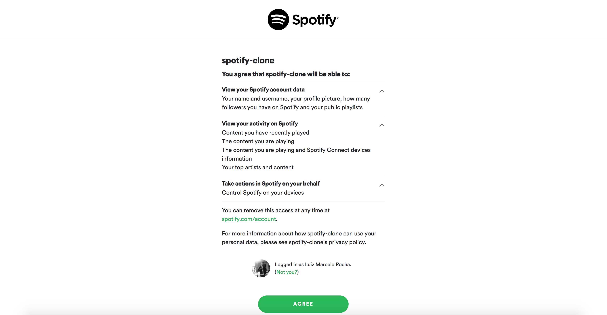

<h1 align="center">
    
</h1>
<h1 align="center">
    
      
</h1>

## 💻 About project (fully responsive)

Personal project built using ReactJS with Hooks, Context API and Redux. You can login using spotify developer API and get your "Discover weekly" songs. Also, it loads your playlists and you can play songs from Discover Weekly playlist. Enjoy it.

## 🛠 Technology

#### **Website**

-   **[HTML5](https://developer.mozilla.org/pt-BR/docs/Web/HTML/HTML5)**
-   **[CSS3](https://www.w3schools.com/css/)**
-   **[ReactJs](https://pt-br.reactjs.org/)** : **[React Hooks, Context API, Redux](https://pt-br.reactjs.org/docs/hooks-intro.html)**
-   **[Firebase](https://firebase.google.com/?hl=pt-br)**

#### **Utilitaries**

-   Editor: **[Visual Studio Code](https://code.visualstudio.com/)**
-   Icons: **[Material UI](https://material-ui.com/pt/)**
-   API: **[Spotify Developers API](https://developer.spotify.com/)**

### Prerequisites

Before you begin, you will need to have the following tool installed on your machine:
[Git](https://git-scm.com)

In addition, it is good to have an editor to work with the code as **[VSCode](https://code.visualstudio.com/)**

### Running the web application (Front End)

```bash
# Clone this repository
$ git clone https://github.com/luizmr/spotify-clone-app.git

# Access the project folder in the cmd/terminal
$ cd spotify-clone-app

# Use the command below to install all dependencies
$ npm install

# Run the application on terminal
$ npm start

# The server is now running at localhost:3000
```

## 📝 License

This project is under the MIT license.

Made with ❤️ by Luiz Marcelo Rocha
